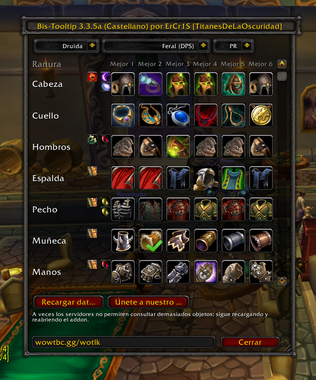

# BisTooltip 3.3.5a Castellano(beta3)

Bistooltip totalmente en castellano y compatible con Lich King

## Metadata

- **Author:** ErCr1S (Niugh) y Zangetsuu
- **Source:** [Original Link](https://warperia.com/addon-3.3.5/bistooltip-3-3-5a-castellanobeta3/)

## Supported Versions

- [x] 3.3.5 

## Screenshots

 

