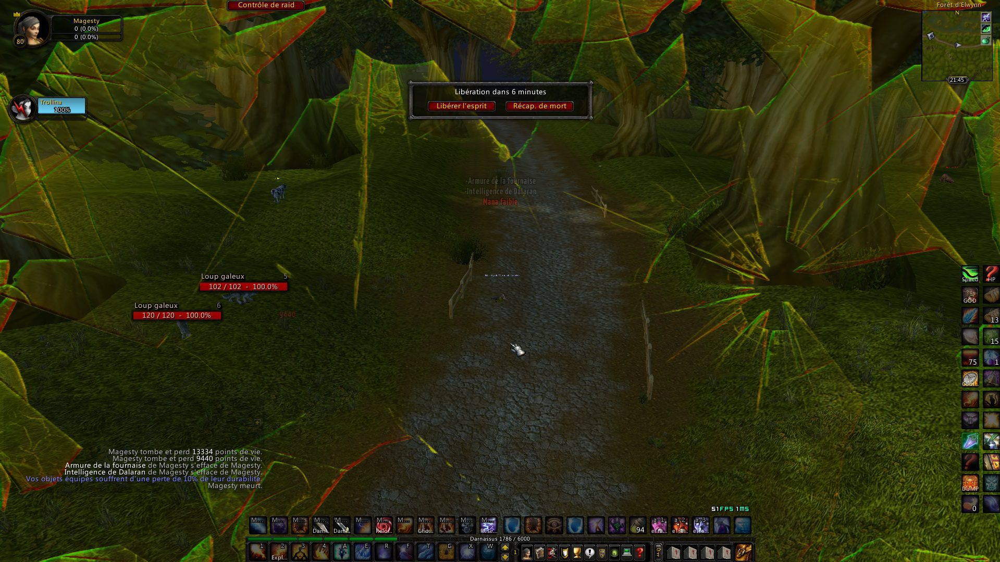

# BloodyMask

Simulates Metro&#039;s Gas Mask effects based on your character&#039;s actions.

## Metadata

- **Author:** bkader
- **Source:** [Original Link](https://github.com/bkader/BloodyMask)

## Supported Versions

- [x] 3.3.5 (WotLK)

## Screenshots

  

