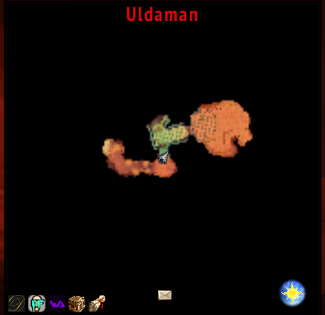

# CircadianRhythm

Addon that shows a GUI window with the Day/Night cycle information.

## Metadata

- **Author:** Bennylavaa
- **Source:** [Original Link](https://github.com/Bennylavaa/CircadianRhythm)

## Supported Versions

- [x] 3.3.5 

## Screenshots

 

