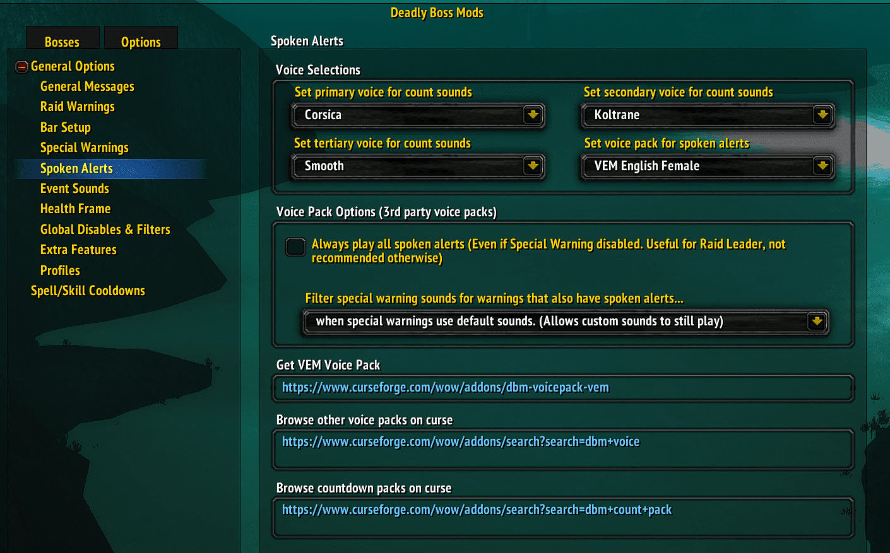

# DBM - Warmane

Alerts you when a Boss begins to cast certain spells or use certain skills.

## Metadata

- **Author:** Zidras
- **Source:** [Original Link](https://github.com/Zidras/DBM-Warmane)

## Supported Versions

- [x] 3.3.5 (WotLK)

## Screenshots

  
  

