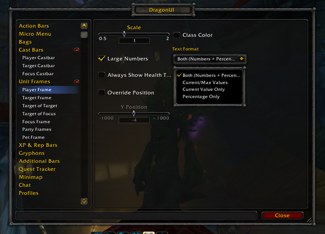

# DragonUI

Dragonflight UI for WotLK 3.3.5a

## Metadata

- **Author:** NeticSoul
- **Source:** [Original Link](https://github.com/NeticSoul/DragonUI)

## Supported Versions

- [x] 3.3.5 (WotLK)

## Screenshots

  
  

