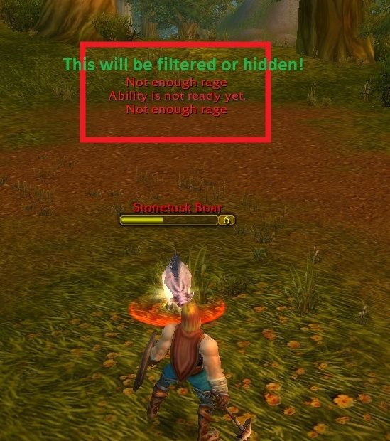

# Error Filter

ErrorFilter manages the errors that are displayed in the blizzard UIErrorsFrame

## Metadata

- **Author:** Fulger
- **Source:** [Original Link](https://warperia.com/addon-3.3.5/error-filter/)

## Supported Versions

- [x] 3.3.5 

## Screenshots

 

