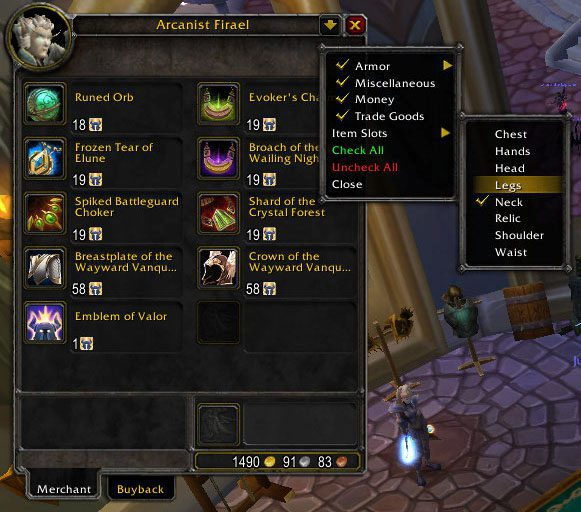
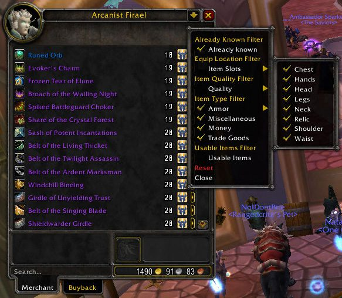

# GoblinVendorFilter

Allows you to filter the current merchant window items.

## Metadata

- **Author:** yssaril
- **Source:** [Original Link](https://warperia.com/addon-wotlk/goblinvendorfilter/)

## Supported Versions

- [x] 3.3.5 

## Screenshots

 
 

