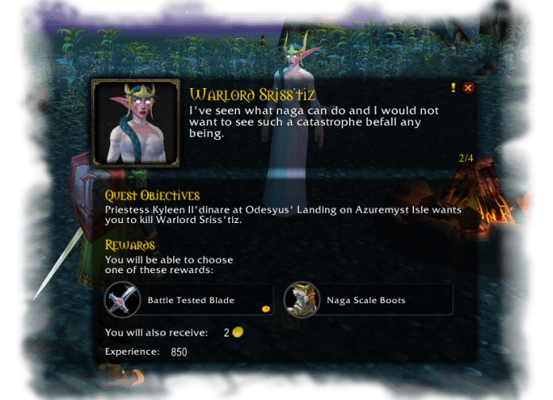

# Immersion

Immersion is a replacement for the dated quest &amp; gossip frames.

## Metadata

- **Author:** leoaviana
- **Source:** [Original Link](https://github.com/leoaviana/ImmersionLK)

## Supported Versions

- [x] 3.3.5 

## Screenshots

 

