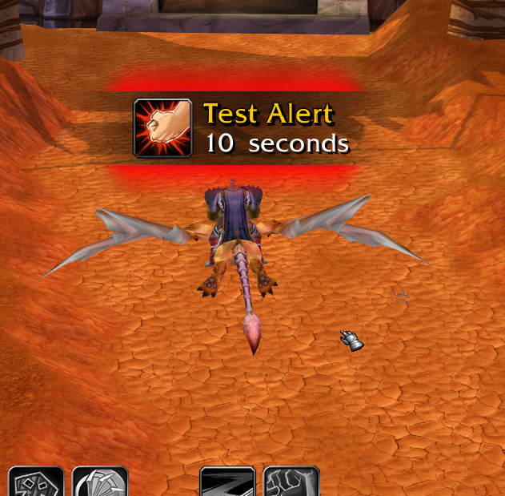

# LossOfControlSmart

An enhanced backport of Blizzard&#039;s Loss of Control alerts for WoW 3.3.5. Big new feature is it auto detects CC that isn&#039;t in the list currently. It adds a lot of CCs throughout time.

## Metadata

- **Author:** thierbig
- **Source:** [Original Link](https://github.com/thierbig/LossOfControlSmart-3.3.5)

## Supported Versions

- [x] 3.3.5 

## Screenshots

 
 

