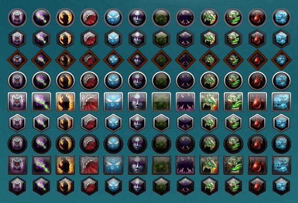

# Masque

Masque is an add-on for Azeroth Legacy that provides a skinning engine for button-based add-ons.

## Metadata

- **Author:** bkader
- **Source:** [Original Link](https://github.com/bkader/Masque-3.3.5)

## Supported Versions

- [x] 3.3.5 

## Screenshots

 

