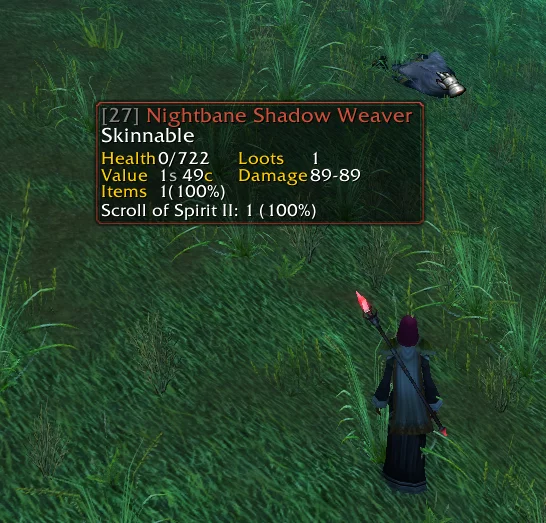

# MobInfo2

Adds information about the hovered mob to the tooltip and shows health/mana.

## Metadata

- **Author:** ileclerk
- **Source:** [Original Link](https://warperia.com/addon-wotlk/mobinfo2/)

## Supported Versions

- [x] 3.3.5 (WotLK)
- [x] 2.4.3 (TBC)
- [x] 1.12.1 (Vanilla)
