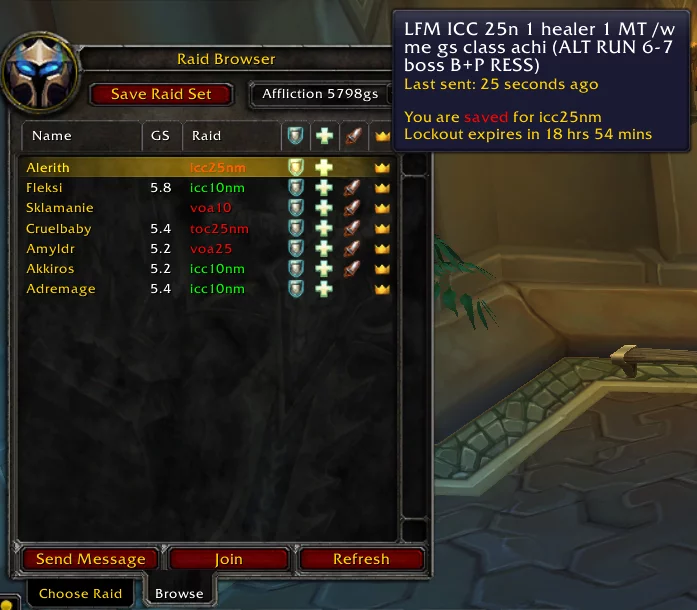

# RaidBrowser

A raid finder that displays any found raids in the raid browser LFR frame.

## Metadata

- **Author:** Unknown
- **Source:** [Original Link](https://warperia.com/addon-3.3.5/raidbrowser/)

## Supported Versions

- [x] 3.3.5 
