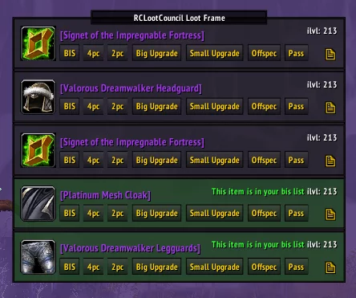
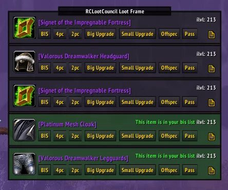

# RCLootCouncil

Interface for running a Loot Council.

## Metadata

- **Author:** broizter
- **Source:** [Original Link](https://warperia.com/addon-3.3.5/rclootcouncil/)

## Supported Versions

- [x] 3.3.5 

## Screenshots

 

