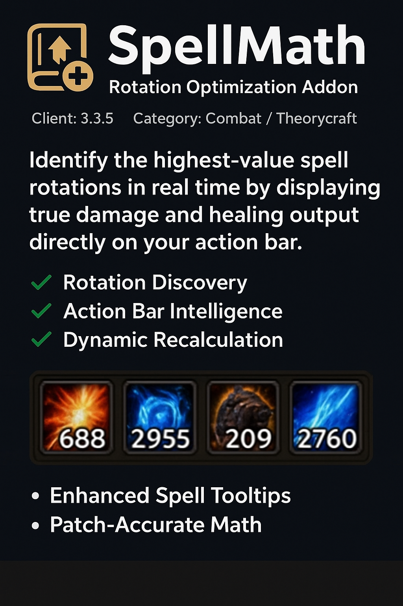

# SpellMath — Skill Rotation Optimization Addon

Combat / Theorycraft SpellMath lets you identify the highest-value spell rotations in real time by displaying true damage and healing output directly on your action bar. Every ability is calculated using current talents, gear, buffs, and combat modifiers, allowing you to instantly see which spell should be cast next for maximum efficiency.

## Metadata

- **Author:** ZoneReaper_
- **Source:** [Original Link](https://warperia.com/addon-wotlk/spellmath-skill-rotation-optimization-addon/)

## Supported Versions

- [x] 3.3.5 

## Screenshots

 

