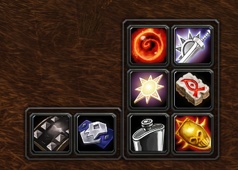

# TrinketMenu

Lightweight trinket manager, updated for 3.3.5

## Metadata

- **Author:** thierbig
- **Source:** [Original Link](https://github.com/thierbig/TrinketMenu-3.3.5)

## Supported Versions

- [x] 3.3.5 (WotLK)

## Screenshots

  

