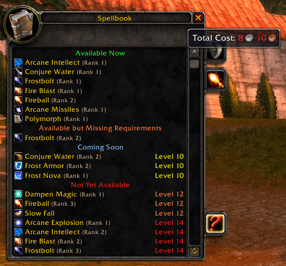

# What&#8217;s Training? Epoch

Adds a list of all the spells for your class in a new tab in the spellbook.

## Metadata

- **Author:** ZythDr
- **Source:** [Original Link](https://github.com/ZythDr/Whats-Training-Epoch)

## Supported Versions

- [x] 3.3.5 (WotLK)

## Screenshots

  

