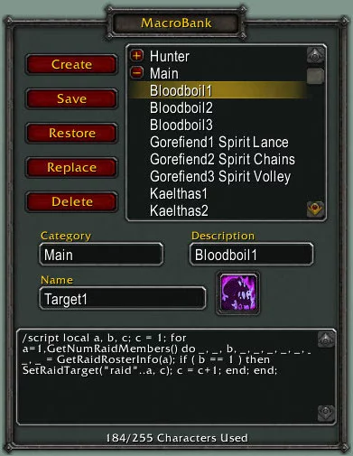

# X-PerlUnitFrames

Replaces the normal unit, party, target, pet frames and adds target-of-target.

## Metadata

- **Author:** MysticalOS
- **Source:** [Original Link](https://warperia.com/addon-wotlk/x-perlunitframes/)

## Supported Versions

- [x] 3.3.5 
- [x] 2.4.3 
